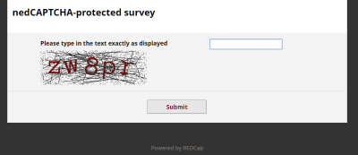

# nedCAPTCHA 2 (REDCap External Module)

[](https://doi.org/10.5281/zenodo.xxx)

nedCAPTCHA 2 adds CAPTCHA protection to REDCap public surveys without depending on an external CAPTCHA provider. The name stands for **n**o **e**xternal **d**ependencies.

This is a new version of [nedCAPTCHA](https://github.com/grezniczek/redcap_nedcaptcha). It uses action-tagged fields on the first survey page instead of a fixed module-level CAPTCHA page, which allows more project-specific layout, field embedding, and compatibility with REDCap Multi-Language Management.

## Purpose

REDCap 8.11.0 and newer can use Google reCAPTCHA, but that is not always suitable for servers with restrictive firewall rules, strict privacy requirements, or policies that prohibit sharing respondent IP addresses with a third-party CAPTCHA service. nedCAPTCHA 2 keeps the challenge generation inside REDCap/PHP.

## Effect

When the module is enabled in a project and an instrument's first public survey page contains an `@NEDCAPTCHA` field, respondents must solve the configured challenge before the normal first survey page is shown. The module supports:

- a simple or complex math problem,
- a distorted text image,
- a custom challenge-response list, or
- a disabled `none` mode that leaves the tagged fields out of normal survey operation without presenting a challenge.

The module stores transient CAPTCHA state in the External Modules log and removes expired entries with an hourly cron. CAPTCHA state expires after 120 minutes. CAPTCHA responses are not saved to the project data unless the **Capture response** option is enabled.



The custom challenge type can also be used as lightweight public-survey password protection by configuring one challenge such as `Type the access key to proceed. = secretaccesskey`.

## Requirements

- REDCap 15.5.0 or newer.
- REDCap External Modules Framework 16 or newer.
- PHP GD with FreeType support.

## Installation

- Clone this repository into `<redcap-root>/modules/nedcaptcha2_v<version-number>`, or install it from the REDCap Consortium External Modules Repo when available.
- In REDCap, go to _Control Center > Technical / Developer Tools > External Modules_ and enable **nedCAPTCHA 2**.
- Enable the module in projects that need public survey CAPTCHA protection.

## Configuration

There are no system-level settings besides the standard External Modules Framework controls.

The only project-level setting is **Debug mode**, available to super users. When enabled, nedCAPTCHA 2 prints additional diagnostic information to the browser console.

All CAPTCHA behavior is configured through the `@NEDCAPTCHA` action tag. In the Online Designer, click the `@NEDCAPTCHA` action tag on the field list to open the nedCAPTCHA Editor. Manual JSON editing is possible, but the editor is the recommended way to maintain settings.

## Basic Setup

1. Put a Text Box field with no validation on the first page of the public survey instrument.
2. Add `@NEDCAPTCHA` to that field.
3. Use the field label as the prompt shown above the challenge.
4. Click the action tag in the Online Designer to configure the CAPTCHA type and options.
5. Consider adding `@HIDDEN-FORM` and `@HIDDEN-PDF` to fields used only for the CAPTCHA page, especially when the response is not captured.

The `@NEDCAPTCHA` field and other nedCAPTCHA helper fields are removed from normal survey operation after the respondent passes the CAPTCHA, or when the module determines that the current request is not the fresh public survey entry point.

## Action Tags

### `@NEDCAPTCHA`

Required to protect a public survey. Add it to one Text Box field without validation on the first survey page. The action tag accepts a JSON object containing the CAPTCHA configuration.

Only one `@NEDCAPTCHA` field should be used on a survey page.

### `@NEDCAPTCHA-INSTRUCTIONS`

Optional. Add it to a Descriptive Text field on the first survey page. While the CAPTCHA is shown, this field's label replaces the normal survey instructions. This is useful for custom intro text and for REDCap Multi-Language Management.

Only one `@NEDCAPTCHA-INSTRUCTIONS` field should be used.

### `@NEDCAPTCHA-FAILMESSAGE`

Optional. Add it to a Descriptive Text field on the first survey page. The field is hidden initially and shown only after an incorrect CAPTCHA response.

Only one `@NEDCAPTCHA-FAILMESSAGE` field should be used.

### `@NEDCAPTCHA-DISPLAY`

Optional. Add it to Descriptive Text fields on the first survey page that should remain visible while the CAPTCHA is presented. This can be used for logos, explanatory text, or other content that belongs on the CAPTCHA screen.

This tag may be used on multiple fields.

### `@NEDCAPTCHA-CUSTOM-CHALLENGE`

Optional and only relevant when the CAPTCHA type is `custom`. Add it to a Text Box field without validation on the first survey page. The module writes the selected custom challenge value into this field and triggers branching logic, which allows you to show custom fields or images based on the selected challenge.

Only one `@NEDCAPTCHA-CUSTOM-CHALLENGE` field should usually be used.

### `@NEDCAPTCHA-CUSTOM-EMBED`

Optional and only relevant when the CAPTCHA type is `custom`. Add it to a field on the first survey page with one string parameter matching a custom challenge value, for example:

```text
@NEDCAPTCHA-CUSTOM-EMBED="challenge_a"
```

When that challenge is selected, the matching field's label is embedded where the CAPTCHA challenge normally appears. Non-matching embed fields are excluded from the CAPTCHA page. Do not combine this tag with other nedCAPTCHA action tags on the same field.

This tag may be used on multiple fields.

## CAPTCHA Options

### Common Options

- **CAPTCHA Type:** `math`, `image`, `custom`, or `none`.
- **Capture response:** When enabled, the submitted CAPTCHA response is stored in the `@NEDCAPTCHA` field. By default, responses are not captured.

### Math Problem

- **Complexity:** `simple` uses addition. `complex` uses two operators selected from addition, subtraction, and multiplication. The generator avoids double multiplication and non-negative results are enforced.
- **Minimum / Maximum operand values:** Positive integer bounds for generated operands. The defaults are 1 and 10.
- **Show as text:** By default, math challenges are rendered as images. This option renders the math expression as text, which may improve accessibility for screen-reader users.
- **Background color / Text color:** Colors may be entered as HTML hex values such as `#ff0000` or as comma-separated RGB triplets such as `255,0,0`.

### Distorted Text Image

- **Length:** Number of characters in the generated challenge. The allowed range is 3 to 8 characters; the default is 5.
- **Re-use challenge:** By default, a new image challenge is created after an unsuccessful attempt. When enabled, the same challenge is reused for retries.
- **Angle variation:** `none`, `slight`, `medium`, or `strong`.
- **Size variation:** `none`, `slight`, `medium`, or `strong`.
- **Noise density:** `off`, `low`, `medium`, or `high`.
- **Background color / Text color / Noise color:** Colors may be entered as HTML hex values or comma-separated RGB triplets.

The image character set is optimized for readability and excludes visually ambiguous characters.

### Custom Challenge/Response

Enter one challenge-response pair per line, separated by `=`:

```text
The color of the sky? = blue
The color of grass? = green
Snow White and the __?__ dwarfs = seven
```

The module randomly selects one pair. By default, response comparison is case-sensitive. Enable **Use case-insensitive comparison for responses** to accept answers regardless of case.

## Styling

The module injects a small number of wrapper elements that can be targeted from custom survey CSS:

- Instructions from `@NEDCAPTCHA-INSTRUCTIONS` are wrapped in `#nedcaptcha2-instructions`.
- Challenges are wrapped in `.nedcaptcha2-challenge`.
- Failed responses cause the response input to receive a red outline and an inline warning icon.

For example:

```css
#nedcaptcha2-instructions {
  margin-bottom: 1rem;
}

.nedcaptcha2-challenge {
  font-size: 1.2rem;
}
```

## Notes and Limitations

- The module is intended for the first page of a fresh public survey. It does not protect data-entry forms, authenticated survey links tied to existing records, returning surveys, survey queue passthroughs, or end-of-survey/return-code flows.
- The Save & Return Later button is hidden while the CAPTCHA is being presented.
- Hidden REDCap fields, except the CSRF token and nedCAPTCHA's own temporary client key, are removed from the CAPTCHA form before submission.
- If custom type is selected without any valid challenge-response pairs, validation falls back to a math CAPTCHA.

## Changelog

Version | Changes
------- | -----------
1.0.0   | Initial release.

## How to Cite This Work

If you use this external module for a project that generates a research output, please cite this software in addition to [citing REDCap](https://projectredcap.org/resources/citations/).

APA style:

> Rezniczek, G. A. (2025). nedCAPTCHA 2 (REDCap External Module) [Computer software]. https://doi.org/10.5281/zenodo.xxx

BibTeX:

```bibtex
@software{Rezniczek_nedCAPTCHA_REDCap_External_Module_2025,
  author = {Rezniczek, Günther A.},
  title = {{nedCAPTCHA 2 (REDCap External Module)}},
  version = {1.0.0},
  year = {2025},
  month = {7},
  doi = {10.5281/zenodo.xxx},
  url = {https://github.com/grezniczek/nedcaptcha2}
}
```

Citation metadata is also available in [CITATION.cff](CITATION.cff).
